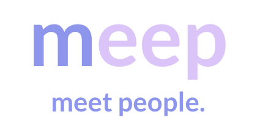

# MEEP
Meet new people who share the same interests and hobbies!

  
## Meep has been deployed online! 
### Visit these sites to demo Meep in mobile and web-app formats
#### Mobile: http://www.responsinator.com/?url=https%3A%2F%2Fmeep-ntezxgy8u-em843.vercel.app%2F
#### Web-App: https://meep-ntezxgy8u-em843.vercel.app/

### Notes about the Prototype
The Login page is implemented in a UI-only fashion, so to see the rest of the application, simply click on "Log In" without typing anything into the textfields.

## Running Locally:
  
### Requirements
  * node.js

### Building the application
 Currently there is only a development build which is described below.

### Testing the build
* run `npm test`
  
### Running the application
The app is currently in a prototype state which is why it's only possible to run it in the development environment and not in a built version. Therefore some basic steps need to be done:

#### Install node
* Make sure you have installed node.js

#### Install node modules
* run `npm install`

#### Start the server
* run `npm start`
* open http://localhost:19006 in your browser
  
## Team Members
* Alex Kobuzovs
* Erin Murphy
* Fergal Duncan-Cox
* James Strachan
* Joanna Chojnowska
* Paul Schreiber
* Sasha Gdaniec
* Warren Braggs

